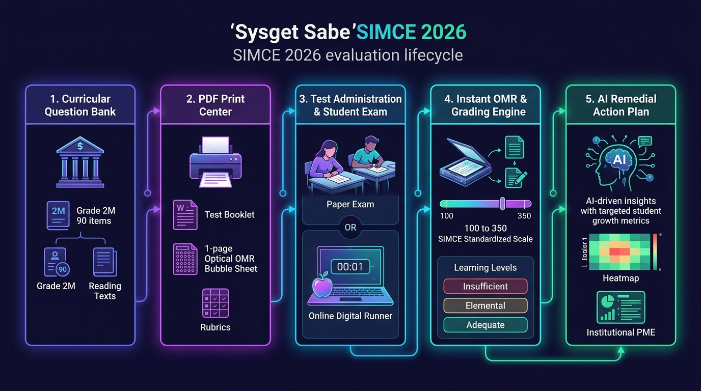
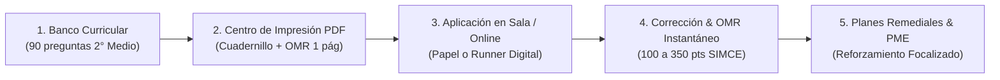

# 📘 Manual Oficial de Usuario — Sysget Saber
### Plataforma Integral de Diagnóstico, Evaluaciones Nacionales & Analítica Curricular SIMCE 2026

---

## 🏛️ 1. Introducción y Propósito Institucional

**Sysget Saber** es la plataforma SaaS diseñada para directivos, equipos de Unidad Técnica Pedagógica (UTP), sostenedores y docentes de establecimientos educacionales de Chile. Su propósito fundamental es **automatizar el ciclo completo de evaluación estandarizada** (SIMCE y PAES), diagnosticar brechas curriculares en tiempo récord y proporcionar planes de reforzamiento pedagógico con **estricto aislamiento por especialidad**.

### Pilares Clave del Sistema:
1. **Alineación Curricular 100% Oficial**: Cobertura estricta de las Bases Curriculares del MINEDUC, matrices de evaluación de la Agencia de Calidad de la Educación y estándares DEMRE.
2. **Aislamiento Pedagógico y de Ambientes**: Separación radical entre el entorno de demostración (*Sandbox / Liceo Bicentenario*) y el entorno real de producción (*Escuela Premilitar Héroes de la Concepción, RBD 31030-1*). Los docentes solo acceden a las asignaturas y cursos de su contrato curricular.
3. **Motor de Impresión PDF sin Fricción**: Generación de cuadernillos tipo facsímil con membrete oficial, hojas de respuesta ópticas (OMR) de 1 sola página para fotocopiado y pautas docentes con rúbricas de desarrollo.
4. **Línea Base Histórica Oficial**: Integración directa de los resultados históricos de la Agencia de Calidad de la Educación (2016 – 2025) para proyectar y monitorear metas institucionales hacia el SIMCE 2026.

---

## 🔄 Infografía del Ciclo de Evaluación SIMCE 2026

---

## 👥 2. Matriz de Roles y Perfiles de Acceso

| Perfil | Rol en Sistema | Entorno | Alcance y Facultades |
| :--- | :--- | :--- | :--- |
| **Super Administrador UTP** | dmin | **Producción** | Supervisión global de colegios asociados (RBD), asignación docente, visualización de la Línea Base Histórica de la Agencia de Calidad, planes PME institucionales. |
| **Docente de Especialidad** | profesor | **Producción** | Gestión exclusiva de su materia asignada (ej. *María Teresa González* en Lengua y Literatura 2° Medio), banco de preguntas por curso, aplicación de ensayos, impresión de cuadernillos e ingreso de respuestas. |
| **Administrador Demo** | dmin | **Sandbox** | Demostración guiada con datos simulados del *Liceo Bicentenario Los Andes* (261 pts proyectados, mapas de calor multi-curso). No altera datos de producción. |
| **Docente Demo (Matemática / Ciencias / Lenguaje)** | profesor | **Sandbox** | Simulaciones guiadas por asignatura (ej. Plan remedial de Martín S., Corrección de rúbricas IA). |
| **Estudiante** | lumno | **Sandbox / Prod** | Rendición digital de ensayos con interfaz interactiva, cronómetro oficial y retroalimentación inmediata. |

---

## 🧭 3. Guía Paso a Paso de Módulos Principales

---

### Módulo 3.1: Dashboard Directivo & Línea Base Oficial SIMCE
*Accesible para: Super Administrador UTP (leontestvirtual1@gmail.com)*

Al ingresar a la plataforma en entorno productivo, el panel principal despliega la radiografía de calidad del establecimiento:

`
┌────────────────────────────────────────────────────────────────────────────────────────┐
│ 🏛️ LÍNEA BASE OFICIAL SIMCE — ESCUELA PREMILITAR (RBD 31030-1)                         │
│ Asignatura: Lengua y Literatura 2° Medio • Fuente: Agencia de Calidad (2016 - 2025)    │
├──────────────────────────┬──────────────────────────┬──────────────────────────────────┤
│ Puntaje Oficial 2025     │ Meta GSE Medio Bajo      │ Brecha de Género 2025            │
│ 219 pts (▲ +2 vs 2024)   │ 240 pts (Brecha: -21)    │ 👩 230 pts vs 👨 213 pts (+17)   │
└──────────────────────────┴──────────────────────────┴──────────────────────────────────┘
`

#### Pestañas de Inteligencia Pedagógica:
1. **📈 Tendencia GSE (2016 – 2025 + Meta 2026)**:
   * Muestra la curva histórica del colegio comparada con el promedio nacional del grupo socioeconómico *Medio Bajo*.
   * Permite constatar la trayectoria: superación del GSE en 2016 (241 pts), caída en pandemia en 2022 (194 pts) y recuperación progresiva (212 ➔ 217 ➔ **219 pts en 2025**).
   * Línea de meta de referencia visible en **240 pts**.
2. **🎯 Distribución por Niveles de Aprendizaje**:
   * Gráfico de barras apiladas porcentual:
     * **Insuficiente**: 72.0% *(con una reducción sostenida de 11.7 puntos porcentuales desde el 83.7% de 2022)*.
     * **Elemental**: 23.8% *(crecimiento sostenido)*.
     * **Adecuado**: 4.3%.
   * **Uso pedagógico**: Establecer metas PME para traspasar estudiantes desde *Insuficiente* hacia *Elemental* mediante los 3 ensayos de 2026.
3. **👥 Análisis de Brecha por Género**:
   * Desglose del rendimiento entre Mujeres (👩 230 pts en 2025) y Hombres (👨 213 pts en 2025).
   * **Alerta Pedagógica Automática**: Notifica la brecha de +17 puntos a favor de las mujeres y el estancamiento de los varones en 213 pts durante 2024 y 2025, recomendando estrategias específicas de motivación lectora masculina.

---

### Módulo 3.2: Banco de Preguntas Organizado por Curso / Nivel
*Accesible para: Docentes y Administradores*

El banco de ítems actúa como el repositorio central de reactivos calibrados. Para garantizar que los cursos no se mezclen, el sistema implementa **píldoras de filtrado estricto por Nivel Escolar**:

`
[ 🎓 2° Medio (90) ]   [ 📚 8° Básico (5) ]   [ 🔬 6° Básico (35) ]   [ 🌐 Todos los Cursos (130) ]
`

#### Características del Banco:
* **Conteo Dinámico de KPIs**: Al seleccionar 2° Medio, las tarjetas superiores computan exclusivamente:
  * **Total Nivel**: 90 preguntas oficializadas.
  * **Selección Múltiple**: 88 preguntas con 4 alternativas (A, B, C, D).
  * **Desarrollo Escrito**: 2 preguntas con rúbricas de corrección analítica (0 a 2 puntos).
  * **Oficiales / Liberadas**: 90 preguntas alineadas a SIMCE.
* **Filtros Curriculares Cruzados**:
  * **Ejes Temáticos**: Lectura Literaria, Lectura No Literaria, Argumentación, Escritura.
  * **Habilidades Cognitivas**: Localizar información, Interpretar y relacionar, Reflexionar y evaluar.
* **Badges Visuales**: Cada ítem indica su nivel escolar, eje, dificultad calibrada y porcentaje de discriminación.
* **Creación de Nuevas Preguntas (+ Nueva Pregunta)**:
  * Asocia automáticamente el nivel escolar activo (2° Medio).
  * Editor de texto enriquecido con soporte para imágenes, textos de lectura compartidos y tablas de criterios de corrección.

---

### Módulo 3.3: Gestión de Evaluaciones y Ensayos Oficiales
*Accesible para: Docentes de Asignatura y Administradores*

Sysget Saber cuenta con las evaluaciones oficiales para 2° Medio ya cargadas y calibradas:

| Código | Título de la Evaluación | Preguntas | Lecturas Incluidas | Estado |
| :--- | :--- | :---: | :--- | :---: |
| SIMCE-2M-LEN-ABR | **Ensayo SIMCE Lenguaje — Abril 2026** | 30 | Gran Muralla China, María Tudor, Antropología, Cuento García Márquez, etc. | Activa |
| SIMCE-2M-LEN-JUN | **Ensayo SIMCE Lenguaje — Junio 2026** | 30 | Chimpancés mediadores, Mitos laborales, Botánica Papaya, Ensayo de Celos. | Activa |
| SIMCE-2M-LEN-AGO | **Ensayo SIMCE Lenguaje — Agosto 2026** | 30 | Literatura universal, crónica periodística, botánica Tejocote + 2 preguntas de desarrollo. | Activa |

#### Acciones Rápidas sobre cada Evaluación:
1. **👁️ Ver Ítems**: Despliega el facsímil interactivo con exactamente las 30 preguntas de la prueba seleccionada (sin mezclar con otras materias).
2. **🖨️ Centro de Impresión / PDF**: Abre el motor de diagramación profesional.
3. **📝 Ingresar Respuestas**: Modal para digitalizar las respuestas de los estudiantes.

---

### Módulo 3.4: Centro de Impresión Institucional y Cuadernillos PDF
*Accesible desde el botón "Centro de Impresión / PDF"*

El motor de impresión está diseñado bajo el estándar MINEDUC/DEMRE para optimizar papel y garantizar un formato impecable:

`
┌────────────────────────────────────────────────────────────────────────────────────────┐
│ 🖨️ CENTRO DE IMPRESIÓN OFICIAL — SYSGET SABER                                         │
├────────────────────────────────────────────────────────────────────────────────────────┤
│ [1. Cuadernillo Estándar]  [2. Por Alumno]  [3. Hoja Respuestas]  [4. Pauta Docente]   │
├────────────────────────────────────────────────────────────────────────────────────────┤
│ Establecimiento: [ Escuela Premilitar Héroes de la Concepción (RBD: 31030) ▼ ]          │
│ Tipo de Hoja: A4 / Carta • Orientación: Vertical • Paginación Continua                  │
└────────────────────────────────────────────────────────────────────────────────────────┘
`

#### Tipos de Documentos Generables:
1. **📄 Cuadernillo de Evaluación Estándar**:
   * Encabezado institucional con el **escudo oficial de la Escuela Premilitar**, RBD 31030, nombre de la prueba, curso y fecha.
   * Instrucciones formales para el alumno.
   * Lecturas con diagramación fluida, tipografía optimizada e imágenes incrustadas (sin cortes artificiales ni páginas en blanco huérfanas).
2. **📋 Hoja de Respuestas Óptica (OMR)**:
   * Matriz de burbujas en 4 columnas compactas para **30 a 35 preguntas**.
   * Cabe exactamente en **1 sola página**, lista para fotocopia masiva.
3. **🔑 Pauta Clave Docente**:
   * Tabla completa con número de ítem, alternativa correcta, eje temático, habilidad evaluada, puntaje y desglose de rúbricas para preguntas de desarrollo.
4. **👤 Cuadernillos Personalizados por Alumno**:
   * Membrete pre-rellenado con nombre del alumno, RUT y número de lista (disponible tras cargar la nómina del curso).
5. **🎯 Ficha de Nivelación Pedagógica**:
   * Documento formal con diagnóstico del alumno, plan de trabajo remedial a 3 semanas y casillas para las 4 firmas oficiales (Estudiante, Apoderado, Docente, UTP).

---

### Módulo 3.5: Ingreso de Respuestas y Corrección Instantánea
*Accesible desde el botón "Ingresar Respuestas"*

1. Selecciona la evaluación rendida (SIMCE-2M-LEN-ABR, JUN o AGO).
2. Digita las alternativas marcadas por cada estudiante (A, B, C, D) y el puntaje obtenido en las preguntas de desarrollo (0, 1 o 2 puntos según la rúbrica).
3. Al guardar, el sistema calcula de inmediato:
   * **Puntaje Estandarizado Nacional** (escala SIMCE 100 – 350 puntos).
   * **Porcentaje de Logro por Eje Curricular**.
   * **Nivel de Desempeño**: *Insuficiente*, *Elemental* o *Adecuado*.
   * **Identificación de Brechas Críticas**: Alumnos que requieren plan de reforzamiento prioritario.

---

## 🔄 4. Checklists Operativos (Flujos de Trabajo Recomendados)

### 📋 Checklist 1: Ciclo de Aplicación en Papel (Modalidad Tradicional)
- [ ] **Paso 1**: Ingresar al sistema con la cuenta institucional de la docente de Lenguaje (luis.leon@premil.cl).
- [ ] **Paso 2**: En la pestaña **Evaluaciones**, seleccionar el ensayo correspondiente al mes (ej. *Abril 2026*).
- [ ] **Paso 3**: Abrir el **Centro de Impresión / PDF**.
- [ ] **Paso 4**: Imprimir 1 juego del **Cuadernillo Estándar** para fotocopiar a los alumnos del 2° Medio.
- [ ] **Paso 5**: Imprimir las **Hojas de Respuestas Ópticas** (1 plana por estudiante).
- [ ] **Paso 6**: Imprimir 1 copia de la **Pauta Clave Docente** para la corrección de las preguntas de desarrollo.
- [ ] **Paso 7**: Aplicar la prueba en sala (tiempo sugerido: 90 minutos).
- [ ] **Paso 8**: Ingresar a **Ingresar Respuestas**, digitar las respuestas recolectadas y generar el informe UTP.

---

### 💻 Checklist 2: Ciclo de Rendición Digital en Laboratorio de Computación
- [ ] **Paso 1**: Habilitar los computadores del laboratorio con el navegador web en [https://sysget-saber.vercel.app](https://sysget-saber.vercel.app).
- [ ] **Paso 2**: Cada estudiante ingresa con sus credenciales de alumno.
- [ ] **Paso 3**: El alumno selecciona la evaluación activa y presiona **"Iniciar Ensayo"**.
- [ ] **Paso 4**: El cronómetro regresivo se activa automáticamente. El estudiante lee los textos y marca las alternativas en pantalla.
- [ ] **Paso 5**: Al presionar **"Finalizar Ensayo"**, el sistema tabula los resultados de forma automática e inmediata en el panel de la docente y de UTP.

---

## 🔒 5. Políticas de Seguridad y Aislamiento de Datos

1. **Protección de Sesiones**: Toda sesión inactiva protege la privacidad de las nóminas de estudiantes.
2. **Inmutabilidad de Producción**: El Modo Sandbox (con datos ficticios) no puede bajo ninguna circunstancia leer, alterar ni sobreescribir las tablas de datos de la Escuela Premilitar en Supabase.
3. **Trazabilidad de Auditoría**: Cada ingreso de respuestas, creación de ítems o modificación de notas queda registrado con marca de tiempo e identificador del usuario responsable.

---

## 📞 6. Soporte y Asistencia Técnica

* **Plataforma Web Oficial**: [https://sysget-saber.vercel.app](https://sysget-saber.vercel.app)
* **Soporte Técnico & Administración**: Sysget Chile — Área de Tecnología Educativa
* **Contacto Directo**: leontestvirtual1@gmail.com

---
*Sysget Saber © 2026 — Plataforma Oficial de Evaluaciones Nacionales y Diagnóstico Curricular.*
